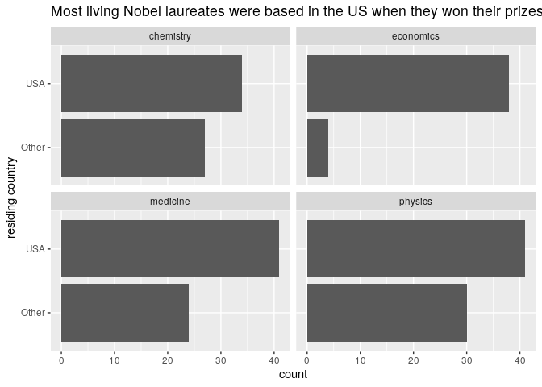

Nobel laureates
================


### attribution

  - Inspiration and baseline materials for this exercise are derived
    from the [Materials for the Designing the Data Science
    Classroom](https://rstudio-conf-2020.github.io/design-ds-classroom/)
    workshop by Mine Çetinkaya-Rundel at rstudio::conf(2020).
  - The data for this exercise are provided by [The Nobel
    Prize](https://www.nobelprize.org/).

### background

In January 2017, Buzzfeed published an
[article](https://www.buzzfeednews.com/article/peteraldhous/immigration-and-science)
on why Nobel laureates show immigration is so important for American
science. In the article, they show that, while most living Nobel
laureates in the sciences are based in the US, many of them were born in
other countries. This is one reason why scientific leaders say that
immigration is vital for progress. In this analysis, we will work with
the data from this article to mimic some of their visualizations as well
as explore new questions.

### learning goals

The goal of this analysi is not to conduct a thorough analysis of the
Nobel Prize data or the Buzfeed article but rather to use the data to
gain more experience working in a scripting environment, working in the
RStudio environment, accessing and managing files with Git and GitHub,
and formatting with markdown.

Additional learning goals:

  - manipulate and transform data to prepare it for visualization
  - summarise data
  - recreate visualizations

### getting help

If you have any questions about the exercise or assignment, please post
them as issues to the
[rdm-community](https://github.com/SOS598-RDM/rdm-community/issues)
repository on the course GitHub organization.

### project requirements

Read the instructions for your assignment in the README of your
assignment repository. Complete your work in the R markdown document
(Rmd) included in the `R` directory of your assignment repository.

Before doing any work, first open the Rmd and Knit it to make sure that
it compiles without errors. The output will have the same file name but
the file extension will be `.md`.

Final output should be:

1.  Rmd with your final code and …
2.  the knitted document (will knit to filetype md), which should
    feature …
3.  push the finished project to your assignment repository on GitHub.

### getting started

Refer to the
[airbnb-san-diego](https://github.com/SOS598-RDM/airbnb-san-diego)
repository for instructions regarding accessing the repository and
interfacing with Git and GitHub using RStudio.

### the analysis

Details of a workflow nearly identical to what you will do for your
assignment are described below, but address your assignment in the
repository created for you.

*packages*

In addition to the functionality provided by base R, we will use tools
provided in a package called tidyverse. Once installed, load the package
so that its functionality is available by calling the library.

*getting the data*

We will use data provided by [The Nobel
Prize](https://www.nobelprize.org/). Here, we can use the url function
wrapped by the read\_csv function to import the data from the Nobel
Prize API.

  - Note that we are not downloading the data to a file but rather
    reading them directly into our R environment. For a reproducible
    workflow, we would probably want to download and save a copy of
    these data in case they change or become unavailable but we merely
    refer to The Nobel Prize organization for this one-time assignment.
  - Data are processed sensu as had been done per
    [Buzzfeed](https://buzzfeednews.github.io/2017-01-immigration-and-science/).

<!-- end list -->

``` r
# read data from Nobel Prize API

nobel <- read_csv("http://api.nobelprize.org/v1/laureate.csv")
```

Descriptions of relevant (there are more) variables are as follows:

  - `firstname`: first name of laureate
  - `surname`: surname
  - `born`: birth date of laureate
  - `died`: death date of laureate
  - `bornCountry`: country where laureate was born
  - `gender`: gender of laureate
  - `year`: year prize won
  - `category`: category of prize
  - `country`: country of laureate in prize year

*mirror Buzzfeed data*

There are some observations in this dataset that we will exclude from
our analysis to match the Buzzfeed results.

Create a new data frame called `nobel_living` that filters for: -
laureates for whom `country` is available - laureates who are people as
opposed to organizations (organizations are denoted with `"org"` as
their `gender`) - laureates who are still alive (their `died_date` is
`NA`)

``` r
nobel_living <- nobel %>% 
  filter(
    !is.na(country),
    !grepl("org", gender, ignore.case = TRUE),
    is.na(died)
  )
```

**Per the Buzzfeed article, most living Nobel laureates were based in
the US when they won their prizes. Examine our data to see if that is
true.**

First, create a new variable to identify whether the laureate was in the
US when they won their prize. We will use the `mutate()` function for
this. The following pipeline mutates the `nobel_living` data frame by
adding a new variable called `country_us`. We use an if statement to
create this variable. The first argument in the `if_else()` function we
are using to write this if statement is the condition for which we are
testing. If `country` is equal to `"USA"`, we set `country_us` to
`"USA"`. If not, we set the `country_us` to `"Other"`.

``` r
nobel_living <- nobel_living %>%
  mutate(country_us = if_else(country == "USA", "USA", "Other"))
```

Next, we will limit our analysis to only the following categories:
physics, medicine, chemistry, and economics.

**An important aside: there are many ways to approach a problem like
filtering data. Text can present particular challenges. How are these
two approach similar, how are they different, why do they yield
different results?**

``` r
nobel_living_science <- nobel_living %>%
  filter(category %in% c("Physics", "Medicine", "Chemistry", "Economics"))
```

``` r
nobel_living_science <- nobel_living %>%
  filter(grepl("physics|medicine|chemistry|economics", category, ignore.case = TRUE))
```

Create a faceted bar plot visualizing the relationship between the
category of prize and whether the laureate was in the US when they won
the nobel prize. Note: Your visualization should be faceted by category.
For each facet you should have two bars, one for winners in the US and
one for Other. Flip the coordinates so the bars are horizontal, not
vertical.

``` r
nobel_living_science %>% 
  ggplot(aes(country_us)) +
  geom_bar() +
  facet_wrap('category') +
  coord_flip() +
  ggtitle('Most living Nobel laureates were based in the US when they won their prizes') +
  xlab('residing country')
```

<!-- -->

**However, many of those US-based Nobel laureates were born in other
countries**

Create a new variable called `born_country_us` that has the value
`"USA"` if the laureate is born in the US, and `"Other"` otherwise.

``` r
nobel_living_science <- nobel_living_science %>%
  mutate(born_country_us = if_else(bornCountry == "USA", "USA", "Other"))
```

Add a second variable to the visualization based on whether the laureate
was born in the US or not. The final visualization should contain a
facet for each category, within each facet a bar for whether they won
the award in the US or not, and within each bar whether they were born
in the US or not.

``` r
nobel_living_science %>% 
  ggplot(aes(country_us, fill = born_country_us)) +
  geom_bar() +
  facet_wrap('category') +
  coord_flip() +
  ggtitle('But of those US-based Nobel laureates, many were born in other countries') +
  xlab('residing country') +
  labs(fill = "birth country")
```

<!-- -->

-----

#### exploring further: follow Buzzfeed’s approach

The plots in the Buzzfeed article are called waffle plots. You can find
the code used for making these plots in Buzzfeed’s [GitHub
repository](https://buzzfeednews.github.io/2017-01-immigration-and-science/).
